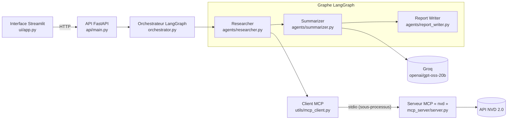

# Security Agent System

> Pipeline multi-agent d'analyse des CVE récentes : recherche dans la base NVD, synthèse par LLM, rapport Markdown.

À partir d'un mot-clé (`apache`, `openssl`…), le système :

1. recherche les CVE publiées récemment dans la base [NVD](https://nvd.nist.gov/) (National Vulnerability Database), via un serveur MCP ;
2. fait analyser ces CVE par un LLM servi par [Groq](https://groq.com/) (vue d'ensemble, priorités, recommandations) ;
3. produit un rapport Markdown (répartition par sévérité, analyse, détail de chaque CVE).

Le pipeline est orchestré par **LangGraph**, exposé par une API **FastAPI** et utilisable depuis une interface **Streamlit**.

## Architecture



| Composant | Rôle |
|-----------|------|
| **Researcher** | Appelle l'outil MCP `search_cves` ; en cas d'erreur ou d'absence de résultat, produit un message explicite au lieu d'échouer. |
| **Summarizer** | Envoie les CVE au LLM Groq et compte les CVE critiques, élevées et moyennes. Sans CVE, il n'appelle pas le LLM. |
| **Report Writer** | Assemble le rapport Markdown et son nom de fichier. |
| **Client MCP** | Seul module qui parle à MCP : lance le serveur en sous-processus stdio, applique un délai maximum (30 s) et transforme toute erreur en message court, sans trace ni clé. |
| **Serveur MCP** | Expose la base NVD sous forme de deux outils : `search_cves` et `get_cve_details`. |

### Structure du projet

```
agents/          Researcher, Summarizer, Report Writer
api/main.py      API FastAPI (/analyze, /results/{job_id}, /history, /health)
mcp_server/      Serveur MCP (FastMCP, transport stdio)
orchestrator.py  Graphe LangGraph : researcher → summarizer → report_writer
ui/app.py        Interface Streamlit
ui/client.py     Client HTTP de l'API utilisé par l'interface
utils/nvd_client.py  Appels à l'API NVD (recherche, détail d'une CVE)
utils/mcp_client.py  Client MCP (langchain-mcp-adapters)
tests/           Tests pytest (NVD, Groq et HTTP simulés)
```

## Installation

Python **3.12** est requis : les versions épinglées (pydantic 2.11, langchain 0.3) ne s'installent pas sur des versions plus récentes comme 3.14.

```bash
py -3.12 -m venv venv              # Windows ; ailleurs : python3.12 -m venv venv
./venv/Scripts/python -m pip install -r requirements.txt       # Windows
# ./venv/bin/python -m pip install -r requirements.txt         # Linux / macOS

cp .env.example .env               # puis renseigner GROQ_API_KEY
```

Pour lancer les tests, installer aussi les dépendances de développement :

```bash
./venv/Scripts/python -m pip install -r requirements-dev.txt
```

## Variables d'environnement

L'API et le serveur MCP les lisent depuis le fichier `.env` (voir `.env.example`). L'interface Streamlit, elle, ne lit pas `.env` : `API_URL` doit être définie dans l'environnement du terminal qui la lance.

| Variable | Obligatoire | Rôle |
|----------|-------------|------|
| `GROQ_API_KEY` | oui, pour `/analyze` | Clé de l'API Groq ([console.groq.com/keys](https://console.groq.com/keys)). L'API démarre sans, mais une analyse qui trouve des CVE échoue. |
| `GROQ_MODEL` | non | Modèle Groq. Défaut : `openai/gpt-oss-20b`. |
| `NVD_API_KEY` | non | Clé NVD pour des limites de débit plus élevées ([demande de clé](https://nvd.nist.gov/developers/request-an-api-key)). |
| `NVD_API_BASE` | non | URL de l'API NVD. Défaut : `https://services.nvd.nist.gov/rest/json/cves/2.0`. Utilisée par les tests pour pointer vers un faux NVD local. |
| `API_URL` | non | URL de l'API utilisée par l'interface Streamlit. Défaut : `http://localhost:8000`. À définir dans le terminal de l'interface (ex. PowerShell : `$env:API_URL = "http://hote:8000"`). |

## Lancement

**API et interface, dans deux terminaux** (depuis la racine du projet) :

```bash
# Terminal 1 : API sur http://localhost:8000 (documentation interactive : /docs)
./venv/Scripts/python -m uvicorn api.main:app --port 8000

# Terminal 2 : interface sur http://localhost:8501
./venv/Scripts/python -m streamlit run ui/app.py
```

L'interface propose un formulaire (mot-clé, période, sévérité, nombre de résultats), affiche les compteurs par sévérité, le rapport et un bouton de téléchargement du fichier `.md`. La barre latérale liste les analyses précédentes ; un clic recharge le rapport.

**Serveur MCP seul** (transport stdio, pour un client MCP externe) :

```bash
./venv/Scripts/python -m mcp_server.server
```

Le serveur lit son entrée standard et écrit le protocole MCP sur sa sortie standard ; ses logs partent sur la sortie d'erreur. Il ne charge depuis `.env` que `NVD_API_KEY` et `NVD_API_BASE`.

## Outils MCP

### `search_cves`

Recherche les CVE publiées récemment dans la base NVD.

| Paramètre | Type | Défaut | Description |
|-----------|------|--------|-------------|
| `keyword` | chaîne, optionnel | aucun | Mot ou expression recherché dans les descriptions. |
| `days` | entier 1–120, optionnel | 120 avec un mot-clé, 30 sans | Fenêtre de publication, comptée depuis aujourd'hui. |
| `severity` | `LOW`, `MEDIUM`, `HIGH` ou `CRITICAL`, optionnel | aucun | Filtre sur la sévérité CVSS v3. |
| `limit` | entier 1–50 | 5 | Nombre maximum de CVE renvoyées. |

Renvoie un objet `{count, cves, message}` :

- `cves` : les CVE de la plus récente à la plus ancienne, chacune avec `id`, `description` (anglais), `score` et `severity` (`null` si NVD ne l'a pas encore évaluée), `published` (AAAA-MM-JJ) et `url` (page NVD) ;
- `message` : explication quand aucune CVE ne correspond (fenêtre et filtres utilisés), sinon `null`.

### `get_cve_details`

Renvoie la fiche complète d'une CVE.

| Paramètre | Type | Description |
|-----------|------|-------------|
| `cve_id` | chaîne, obligatoire | Identifiant au format `CVE-AAAA-NNNN` ; les espaces et la casse sont normalisés. |

Renvoie les champs d'une CVE de `search_cves`, plus : `last_modified`, `vuln_status` (ex. `Analyzed`, `Rejected`), `cwes` (identifiants CWE), `cvss` (toutes les entrées CVSS disponibles : version, vecteur, score, sévérité, source, type `Primary`/`Secondary`) et `references` (les 5 premières, avec URL et tags).

### Erreurs

Un paramètre hors bornes, un identifiant mal formé, une CVE introuvable ou une erreur NVD renvoient une erreur d'outil MCP (`isError`) avec un message explicite, sans trace ni clé API. Par exemple : `CVE-2099-99999 introuvable dans la base NVD.`

## Exemples d'appel de l'API

Avec seulement le mot-clé et le nombre de résultats (fenêtre par défaut de 120 jours, toutes sévérités) :

```bash
curl -X POST http://localhost:8000/analyze \
  -H "Content-Type: application/json" \
  -d '{"keyword": "apache", "max_results": 5}'
```

Avec une fenêtre de 30 jours et un filtre de sévérité :

```bash
curl -X POST http://localhost:8000/analyze \
  -H "Content-Type: application/json" \
  -d '{"keyword": "openssl", "max_results": 10, "days": 30, "severity": "CRITICAL"}'
```

Contraintes : `keyword` de 2 à 100 caractères, `max_results` de 1 à 20, `days` de 1 à 120. La réponse contient `job_id`, `keyword`, `status`, `cve_count`, `message`, `critical_count`, `high_count`, `medium_count`, `report` (Markdown) et `filename`.

| Méthode | Route | Description |
|---------|-------|-------------|
| POST | `/analyze` | Lance une analyse complète. |
| GET | `/results/{job_id}` | Résultat d'une analyse précédente. |
| GET | `/history` | Liste des analyses effectuées. |
| GET | `/health` | État de l'API. |

## Tests

```bash
./venv/Scripts/python -m pytest -q
```

Les tests n'accèdent ni à Internet ni à Groq : NVD, le LLM et l'API HTTP sont simulés. Les tests du client MCP lancent le vrai sous-processus du serveur, relié à un faux NVD en HTTP local.

## Choix techniques

- **`mcp` limité à la version 1.x (`mcp==1.30.0`).** La version 2.0 du SDK renomme `FastMCP` en `MCPServer` et déplace le module : `mcp.server.fastmcp` n'existe plus. Le serveur reste écrit pour l'API 1.x.
- **`langchain-mcp-adapters==0.1.14` et `langgraph==0.2.76`.** Le projet utilise langchain-core 0.3. L'adaptateur 0.2.0 déclare `langchain-core>=0.3.36`, mais importe `langchain_core.messages.content`, qui n'existe qu'en langchain-core 1.x ; les 0.2.x suivantes exigent explicitement langchain-core 1.x. La 0.1.14 est la dernière version qui fonctionne réellement avec langchain-core 0.3. Elle importe `langgraph.types.Command`, disponible à partir de langgraph 0.2.46, d'où la montée de langgraph à 0.2.76.
- **Appels NVD via un serveur MCP.** Les outils NVD sont exposés selon un protocole standard : ils peuvent être utilisés par l'agent LangGraph comme par n'importe quel autre client MCP, et leurs schémas (bornes, valeurs possibles) sont publiés avec eux.
- **`GROQ_API_KEY` jamais transmise au sous-processus MCP.** Le serveur MCP n'a besoin que des variables NVD. Le client ne lui transmet que `NVD_API_KEY` et `NVD_API_BASE` (en plus de l'environnement système minimal fourni par le SDK MCP), et le serveur ne charge que ces deux variables depuis `.env`. Une fuite éventuelle du serveur n'expose donc pas la clé Groq.
- **Migration future vers `mcp` 2.x et `langchain[mcp]`.** Elle implique de passer à langchain 1.x. L'utilisation de l'adaptateur est isolée dans `utils/mcp_client.py` pour limiter la migration côté client à ce seul fichier.

## Limites connues

- **Un sous-processus par appel d'outil.** Le client MCP ouvre une nouvelle session, donc relance le serveur, à chaque appel.
- **Recherche par mot-clé large.** La recherche NVD porte sur le texte des descriptions : un mot-clé comme `apache` remonte aussi des CVE de produits Apache sans rapport entre eux.
- **CVE récentes sans score.** NVD n'a souvent pas encore évalué les CVE très récentes : leur score et leur sévérité sont absents, et le filtre de sévérité les exclut.
- **Résultats en mémoire.** Les analyses sont gardées dans la mémoire de l'API : l'historique est perdu à chaque redémarrage.
